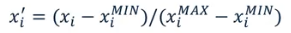
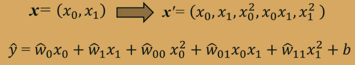
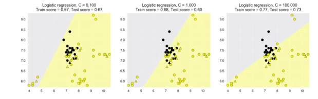
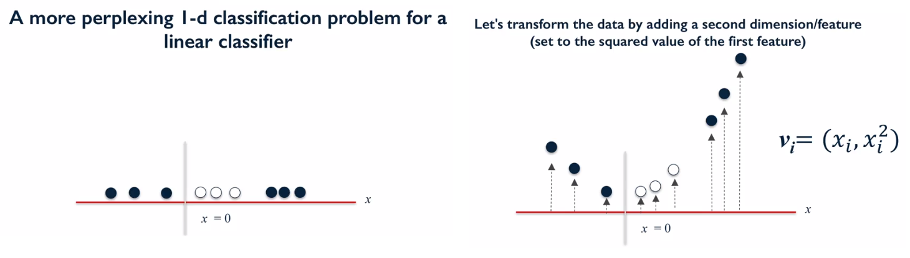
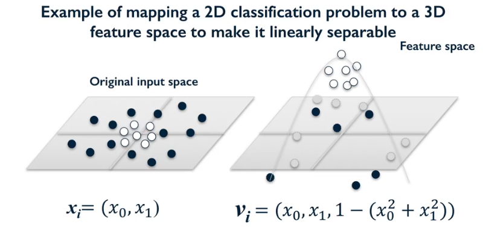
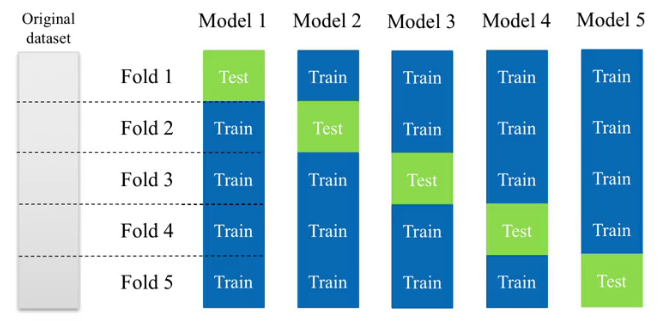
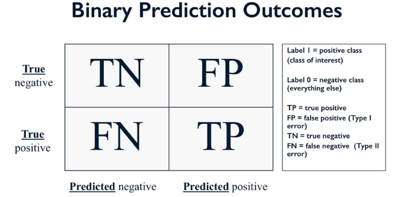
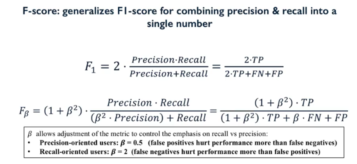

# coursera-python-ml

## Week 1

### Key Concepts
- 2 key classes of ML algorithms
- **Supervised learning** (predict some output value that is associated with each input item). _Learning to predict target values from labelled data._ If the outout is a category with a finite and defined number of possibilities, then this is a classification task, and the function we train is a classifier. If the output variable is a number (e.g. amount of time in seconds, building energy usage), then this is a regression task, and we train a regression function.
- We typically denote a table of data items using X, with one data item per row. Labels we associate with each item are stored in variable y. _The goal is to learn some function that maps data item X into a label in Y_. To do this, the system is given a set of labelled training examples - inputs X _i_ and Y _i_, which are used to identify the function that best maps to the desired output.
- Where does the initial set of labelled data come from? Typically, from human judges.
- Can be easy or difficult, based on how much label data is needed, level of domain knowledge required, and complexity of the labelling task.
- Crowdsourcing platforms like Mechcanical Turk/CrowdFlower have been significant in connecting sponsors with groups of workers who can provide explicit labels using human intelligence.
- Implicit labels can also be inferred, for example search engine detects user clicking on a result and not returning for ~2 mins, that could be used as an implicit label for the returned page. i.e. longer on the page = more releveant to their query.
- **Unsupervised learning** for cases where we only have input data, and no labels to go with the data. The problems we solve here involve taking the input data and trying to find useful structure in it.
- Structure could be clusters or groups. e.g. segmenting users based on web traffic/clickstream data, then using this model/algorithm to tailor site offerings to each group to increase liklihood of purchase, provide better experience.
- _You don't know how many user groups you have_ ; typical unsupervised learning problem
- Unsupervised learning can also be used to train an algorithm to spot outliers (outlier detection). This doesn't assume future attacks will be the same form as previous attacks, but does assume that features of attacks will look different to how users generally interact. 
### Solving problems using ML
- Three basic steps
- **Figure out how to represent the problem in terms the computer can understand**, and choose the type of classifier that's appropriate. Get the data, formulate the description of your object that you're interested in recognising in a way that can be fed into the algorithm. e.g. an image could be reperesented as an array of coloured pixels, meta data .. metadata of a card transaction like time, place, amount of £ for the transaction.
- Also known as feature extraction/feature engineering. Attribute values are features of X. 
- **Decide on evaluation method** that provides a quality of accuracy score. Following training, we can do failure analysis to see where the algorithm is making mistakes, and use this to refine the feature set. 
- **Find the optimal model** that gives the best evaluation outcome for the problem. 

### Python tools for ML
- `scikit-learn, scipy, numpy, pandas, matplotlib` will be used here. `scikit-learn` is the most popular python library for ML, and forms the basis of this course. Many sample applications and code online.
- scikitlearn user guide and API reference are useful. 
- `import scipy as sp`
- We'll be using scipy to generate _sparse matrices_, big tables that consist mostly of 0s.
- numpy provides fundamental data structures (e.g. multi dimensional arrays). Typically data fed to scikit is in this format.

### An example problem
For reference: [Jupyter Notebook](https://dataplatform.ibm.com/analytics/notebooks/v2/18054cb0-8084-4bcd-9243-d0c9b3efb01d/view?access_token=3224314752b5beefeb1f4194e4b03eddd94bac83f759b1de2241324cf3f00c91)
- Object recognition system - simple but relects the same key concepts in real world systems.
- _Training a classifier to distinguish between different types of fruit_
- Recorded measurements in a table of different fruits. 
- Predicting fruit types might seem silly and moot .. but food companies do rely on ML techniques like this, for automated quality control, screening for bad fruit whilst processing etc. (Rotton fruit detection uses UV light that can detect interior decay, which is less visible on the surface .. but it's still taking an input and using this to score and make decisions)
- In supervised learning, the data will also include a label column - this can be derived from info in one or more columns.
- If we use data to train, we cannot use this same data to evaluate. Evaluation should always be done using unseen data.
- `train_test_split` randomly shuffles the data set and splits off a certain percentage for training, and puts the rest in a different variable for testing. Here we're doing 75/25 split, which is pretty standard.
- `X` for the different variables, `y` for the labels, e.g.:
```
X = fruits[['height', 'width', 'mass', 'color_score']]
y = fruits['fruit_label']
X_train, X_test, y_train, y_test = train_test_split(X, y, random_state=0)
```
- `random_state` provides seed value. 
- Looking at the data set first (via visuals, or just having a scroll) is generally a good idea. 
    - Gives you a sense for what's in the dataset, and any other cleaning or pre-processing you might need to do
    - The range and distribution of values that is typical for each attribute
    - Particularly valuable when dealing with text that is represented by multiple features that have been extracted in pre-processing. 
    - Notice missing or noisy data
    - Data types
    - Not enough examples of a particular labeled class
    - Might not need to apply ML to this problem - there might be another way to classify in a machine readable format (e.g. geolocation stored in image metadata to infer location rather than training classifier)
- _Only use the test set for testing_ - this complete separation is important and will be covered later.
- Can use a `matplotlib cmap` (`from matplotlib import cm`) to plot scatters/histograms breaking down each feature by the labels.
- Well defined classes and separation in the feature space is a good indication that suggests the classifier is likely to be able to predict the class label from the features with good accuracy. Visualisation used in this module works well with feature sets of less than 20.
- Unsupervised learning has different vis techniques to cover large feature dimensions (hundreds, thousands, millions of features), to represent each object.
- Feature pair plot plots all possible pairs of features and produces scatter plot for each pair, showing whether features are correlated or not.
- Diagonal shows histogram with distribution of feature values for that feature.
- Can also look at features that use a subset of 3 features by building a 3d plot (this is awesome)

### K-nearest neighbors classification
- aka `k-NN`, can be used for classification and regression. An example of instance based or memory based supervised learning (memorize labeled examples from training set and use this to classify new objects later).
- `k` refers to the number of nearest neighbors the classifier will retrieve and use to make its predicition.
- k-NN has three steps that can be specified:
    - when it sees a previously unseen data object, it looks at the training set to find the k examples that have the closest features.
    - then looks up class labels for those k-NN examples
    - finally, combine the labels of those exampes to predict the label of the new object, typically, via majority vote.
- `query point` is the point you want to classify
- `decision boundaries` are the lines between one class region and the next. 
- decision boundaries are based on ecludian distance. 

## Week 2
### Intro to Supervised ML
- Looking beyond k-NN to other algorithms, how to apply them, and how to interpret their results
- _feature representation_ is taking an object (e.g. a piece of fruit) and converting it to numbers a machine can understand
- k-NN recap:
    - `from sklearn.model_selection import train_test_split` and `from sklean.neighbors import KNeighboursClassifier`
    - `X_train, X_test, y_train, y_test = train_test_split(X, y, random_state=0)` where `X` is feature df and `y` contains corresponding labels
    - `knn = KNeighborsClassifier(n_neighbors = 5)`
    - `knn.fit(X_train, y_train)`
    - `knn.score(X_test, y_test)`
    - `knn.predict(example_feature_data)`
- Supervised learning can be divided into two types of tasks - classification and regression - both take a set of training data and learn mapping to a target value. Classification maps to a discrete class value (can be binary (yes or no), multi-class (fruit example), or multi-label (entitiy extraction)). Regression predicts a continuous variable.
- Relationship between model complexity and accuracy will be explored as we learn about the new algorithms. Generally, when measuring performance against the training set, more complex models will fit the training data better and better (obviously). However, when evaluating against a test set (generally good practice .. ), there is typically an initial accuracy gain from adding model complexity, but then a decrease in test set accuracy as the model becomes overfit to the training data, and doesn't capture more general trends / patterns which allow it to generalize to unseen data. 
- Statistically, input variables = independent variables and outcome variables = dependent variables.

### Overfitting and Underfitting
- successful supervised learning is gauged on the algorithms ability to predict on unseen data.
- algorithm will assume test set is drawn from same underlying distribution as training set - _overfitting_ typically occurs when we try to fit an overly complex model with insufficient data volumes. _The model can't see more general, global data patterns if the training set is too small_ - there is not enough data to constrain the model to respect the broader trends.
- Understanding, detecting, and avoiding overfitting is perhaps the most important aspect of applying supervised ML.
- Regression example: applying linear regression when the model needs to be more complex leads to underfitting. Quadratic relationship could give a curve, provide improved fit to the training data. If we believe the relationship between variables to be a function of several different parameters, a polynomial regression may fit better, and capture more subtle trends, but also has much higher varience, leading (potentially) to overfitting (too localized to the training data)
- For a simple 2 dimensional classification, the problem is in defining the decision boundary. A linear classifier can underfit (a la the above example), simply doesn't capture the patterns, and fit quite well, if it is aware of the location of certain data points. Overfitting would again, be overly complex and fit very well with the training data, but be too specific. Highly variable. 
- For k-NN, the general idea is that as we decrease K for k-NN classifiers, we increase the risk of overfitting because, where K=1 for example, we're trying to capture very local changes in the decision boundary that may not lead to good generalization behavior for future data. 

### Datasets
- `sklearn` has a variety of methods to create synthetic datasets in the `sklearn.datasets` lib.
- synthetic data sets typically have low number of features/dimensions. Makes them easy to explain and visualize. high dimensional (typically real world data sets are) datasets have most of their data in corners with lots of empty space, making it more challening to visualise
- `make_regression`, `make_classification`, `make_blobs`
- we'll use fruits data set for multi-class classification

### k-NN : Classification and Regression
- To make a classification predicition for any query point, the classifier looks back in its training set to identify the k neighbors.
- increasing k can result in a much smoother decision boundary, i.e. lower complexity and less variance - which can result in better performance on unseen test data, as global trends are better reflected in the model. 
- k-NN for regression works as you would expect - find the k neighbors, and the prediction = average y (continuous variable) of the k training points.
- an r^2 (r squared) value is used to assess how well the regression model fits the data.
- k-NN is clear and easy to understand why a prediticion was made. Can be a reasonable baseline with which to compare more complex models. When the training data has many instances/festures, or with sparse data (lots of features, but mostly 0's), k-NN can be slow. 
- _We have not explored the metric parameter_

### Linear Regression - Least-Squares
- Linear model expresses the target outputt in terms of a _sum of weighted inputs_.
- Each input feature is denoted x0, x1, etc, and each feature (xi) has a corresponding weight (wi). (This is similar/_the same?_ to evaluating inputs via weighted nodes in a single layer NN)
- Least-squares linear regression finds the line through the training data that minimizes the means squared error of the model - i.e. the sum of the squared differences between predicted targetand actual target for all points in the training set. It finds the slope (w) and y intercept (b) that minimizes the mean squared error.
- There are no parameters to control model complexity.
- Model complexity is based on the nature of the weights on the input features. Simple models have weight vector closer to zero (more features are not used at all, or have minimal impact on the outcome, i.e. a very small weight)
- Learning algorithm predicts the target value from each training example, then computs a loss function for each (penalty for incorrect predictions). Incorrect = predicted value is different than actual target value. An example - squared loss function would return the squared difference between target and actual as the _penalty_.
- Algorithm then computs/searches for the set of w,b params that minizies the total of the loss function against all training points.
- `from sklearn.linear_model import LinearRegression` to implement - e.g. `linreg = LinearRegression().fit(X_train, y_train)`
- then `linreg.coef_` = w weight, and `linreg.intercept_` = b. This is just y = mx + c.
- _If a scikitlearn object attribute ends with an underscore, it means these were derived from training data and not quantities set by the user_
- k-NN doesn't make a lot of assumptions about the data structure, so gives potentially accurate but sometimes unstable predictions that are sensitive to small changes in training data. Linear models make strong assumptions about data structure, providing stable but potentially inaccurate predictions. 

### Ridge, Lasso, Polynomial Regression
#### Ridge
- Ridge regression is another way to estimate w and b for a linear model. It uses the same least-squares criterion, but adds a penalty for large variations in w params. 
- Regularisation = the addition of the penalty term. This is useful because it prevents overfitting , so improves likely general performance of the model by restricting possible parameter selections. Regularisation usually reduces complexity of final estimated models. Reduced complexity = reduced weights, and regularisation supports this because bigger weights incur a higher penalty. Practically, this means that regression accuracy on problems with lots of features can be notably improved.
- The amount of regularisation to apply is controlled by the alpha parameter (L2 penalty). Larger = more regularisation. (default = 1.0). Setting alpha to 0 is what we were working with earlier, minimizing to total squared error.
- `from sklearn.linear_model import Ridge`, then use the estimator object as we did before - e.g. `linridge = Ridge(alpha=20.0).fit(X_train, y_train)`
- Regularisation becomes less important as volume of training data increases.
- We can get better results from ridge regression by applying _feature preprocessing and normalization_.
- Because regularisation is imposing the sum of squares penalty on the size of the weights, and the scales of the different features can be very different, then different scales have different impacts on the total penalty incurred (because it's a sum of squares) - transforming the input features to be on the same scale means the ridge penalty is more evenly applied and generates better results.
- Bottom line? _Normalisation is important_, and will study more as we go. 
- *MinMax scaling* is a widely used form of feature normalisation. This transforms all input variables so they are on a scale between 0 and 1. This is done by taking the min and max values from each feature on the training data, then applying the minmax formula:

- Example use:
```
from sklearn.preprocessing import MinMaxScaler
scaler = MinMaxScaler()
scaler.fit(X_train)
X_train_scaled = scaler.transform(X_train)
X_test_scaled = scaler.transform(X_test)
clf = Ridge().fit(X_train_scaled, y_train)
r2_score = clf.score(X_test_scaled, y_test)

# Can do fitting and transformation together on training set using
scaler = MinMaxScaler()
X_train_scaled = scaler.fit_transform(X_train)
```
- Things of nooooote:
    - we apply the same scalar object to both training and test set
    - we train the scaler on the training and not the test data
    - *these are critical!* If the same scaling is not applied to training and test sets, you'll have random data skew and invalid results. If the scalar is prepared (or other normalisation method) with the test set, we get Data Leakage (training phase has information that has leaked from the test set).
- Downside is that transformed features can be harder to interpret.
#### Lasso
- Lasso also adds regularisation penalty, this one is L1. Looks similar, but is a sum of the absolute values, rather than sum of squares. 
- This sets parameter weights to 0 for least influential variables (called sparse solution), is a kind of feature selection.
- alpha controls L1 regularization (still not quite got my head around alpha..) - there is an optimal range for alpha that neither under or over fits (of course different for each data set), and other factors like preprocessing methods
- Use *ridge* when you have many small/medium sized effects on output variables. Use *lasso* when you have only a few variables with medium/large effect on output.
- `Lasso` much the same to implement as `Ridge` above, but has a `max_iter` arg, this will increase computation time, but will assist with convergence warnings. 
- can look at features with non-zero weight to understand heavy weights and strong relationships between input variables.
#### Polynomials
- Taking two data points, multiplying them all by each other in every way to get 5 dims, and now write a new regression problem to predict y^ but with these 5 features instead of 2.
- _This is still a a linear regression problem_, the features are just numbers within a weighted sum.

- ^ Polynomial feature transformation, transforms a problems into a higher dimensional regression space, and allows us to use a richer set of complex functions to fit the data. _This is very effective with classification_. `from sklearn.preprocessing import PolynomialFeatures`
- When we add these features, we're adding to the models ability to capture interactions between the different variables by adding them as features to the model.

### Linear Classifiers
#### Logistic Regression
 - (Actually used for classification!)
- :FUTURE READING: - Non-linear basis functions for regression.
- In it's simplest form, the target variable of a logistic regression is a binary classification value.
- The logistic function is an S-shaped curve that gets closer to 1 as the input value increases. Applying the logistic function compresses the output of the linear function so that it is limited to a range between 0 and 1. Different values of b (intercept) and  and w (coefficients) will give different variants of the s-shape - but will always be between 0 and 1.
- Logistic regression between data set with 2 features gives a linear decision boundary 
- `from sklearn.linear_model import LogisticRegression`
- Often get similar results here as you would from linear svc, 
- Regularization penalty applies here too, as it did for lasso and ridge regressions, which is controlled by the parameter c. Same L2 regularization penalty is used and is turned on by default with a value of c=1. Higher value of C = less regularization. 
- High values of C = logistic regression trues to fit training data as well as possible.
- Lower values of C = model tries to find model coefficients that are closer to 0, even if the model fits training data worse. 


#### Support Vector Machines
- Linear models being used for classification - this approach takes the output of the linear function and applys the sine function to produce a binary output with 2 possible values (i.e. one of 2 class labels).
- If the target value is greater than 0, the function returns a 1. Less than 0, -1.
- classifier margin is the max width the decision bounday area can be increased before hitting a data point
- best classifier might have largest margin - the linear margin with the maximum margin is a linear support vector machine (LSVM).
- `from sklearn.svm import SVC`

- Linear models are simple and easy to train, offer fast predictions, scale well to large datasets and work well with sparce datasets. 
- Might get better performance from other models for low-dimensional data, and for classifiction, data may not be linearly seperable  (explored in SVMs with non-linear kernels)

#### Multi-class classification
- Real-world ML classification problems tend to require prediction of a target category with more than 2 labels. Scikit makes this easy, and does this by converting a multiclass problem into a series of binary problems. 
- How? It identifies that the target is a categorical variable, and then creates different binary classifiers for each category against all other classes. Then scores the input against each binary classifier, and classifies as the highest scoring category. Simple!

#### Kernelized Support Vector Machines
- With real data, mny classification problems aren't as easy as drawing a line between two plotted features - often they are not linearly separable.
- SVMs can provide more complex models that go beyond linear decision boundaries, and can be used for classification and regression. 
- In essence, kSVMs take the original input data space and transform it to a higher dimensional feature space, where it becomes easier to classify the transformed data using a linear classifier.
- So - mapping the 1d space into 2d (e.g. y = square of the first feature). No new information is being added (because 1d data point holds all the info), and we can now learn a linear support vector machine in this 2d feature space.

- Can predict future inputs by translating the 1d value into the 2d feature space and using the 2d SVM
- Also very apparent when moving from 2d > 3d as well

- Transformation creates this parabaloid - the central points are higher as they are closer to 0,0, therefore closer to 1 on the new vector. This allows us to create a linear hyperplane (e.g. z=0.9) that easily/almost separates the two classes. The decision boundary consists of the set of points in 3d space where the paraboloid intersects the 
margin hyperplane decision boundary. This corresponds to an elipse-like decision boundary in 2d space that separates the central plints from the others on the original image.
- There are lots of different kernels that can be applied to data in this fashion, which correspond to different transformations. We're going to focus on _RBF_, the radial basis function kernel, as well as looking at polynomial kernel.
- Kernel function tells us "given 2 points in the original input space, what is their similarity in the new feature space?"
- For the radial basis function (RBF) kernel, the similarity between the two points and the transformed feature space is an _exponentially decaying function_ of the distance between the vectors and the original input space. Use transforms all the points inside a certain distance of class0 to one area of transformed feature space, and all points in class1 outside a certain radius get moved to a different area of the feature space. Points between the classes thaqt are close to one another may lie along the maximum margain for a SVM in the transformed feature space.
- The kernelized SVM tries to find the decision boundary with the maximum margain between classes, using a linear classifier in the transformed feature space, not the original input space.
- The linear decision boundary in the transformed feature space correspondes to a non-linear decision boundary in the original input space. The kernel trick means that internally, the algorithm doesn't have to perform the actual transformation to the new high dimensional feature space (!) - does this by computing the more complex decision boundaries in terms of similarity calculations between pairs of the points in high dimensional space where the transformed feature representation is implicit.
- This similarity function (mathematically a kind of dot product) is the kernel in the kernelised SVM.
- Certain kind of high dimensional spaces can have simple kernel functions, which makes it practical to apply SVMs when the underlying transformed feature space is complex or infitely dimensional.
- Can easily plug in different kernels, choosing one to suit properties of our data.
- `from sklean.svm import SVC`
- polynomial kernal looks like the quadratic solution .. also takes in `degree` parameter which controls model complexity and computational cost of the transformation
- RBF also has gamma property, which controls how far the influence of a single trending example reaches, which impacts how tightly the decision boundaries end up surrounding points in the input space.
- small gamma = large similarity radius (smoother decision boundary). large gamma = small similarity radius = tighter, more complex decision boundaries and potential overfitting
- SVMs also have regularization parameter, `C`. which controls tradeoff between satisfying maximum margain, and avoiding misclassification errors on training set. `C` interacts with gamma.
- If gamma is large, `C` will have little or no effect, but for a small gamma, the model is much more constrained and `C` will have more influence.
- Gamma and `C` are typically tuned together:
    - Gamma typical values 0.0001 and 10
    - `C` typical values 0.1 to 100
- Important to normalize data when working with SVMs.
- scaling the data provides great impact on SVM performance
SVMs are good:
- on a range of datasets
- flexible as different kernel functions can be specified, or customer kernels can be defined
- on low and high dimensional data (good for text classification)
SVMs are not so good:
- in efficiency (runtime speed and memory usage) on datasets over 100k+ observations, so might become unpractical.
- as they need careful normalisation of features and parameter tuning
- do not provide direct probability estimates, which are needed for some applications. 
- difficult to understand why

### Cross Validation
- method of evaluation that goes beyond evaluating a single train/test split of the data, as both sets come from the same underlying distribution. Cross validation gives more stable and reliable estimates of how the classifier is likely to perform on average, by running multiple different training and test splits, and averaging the results. 
- most common type of cross validation is `k-fold`, with k sets of 5 or 10:

- `from sklearn.model_selection import cross_val_score`
- 3 fold by default. set by defining `cv=x`
- Computing the accuracy like this gives useful information about how sensitive the model might be to the nature of the specificed training set.
- The way that the data is structured/ordered could cause issues in this approach (i.e. if you have all of one class followed by all of another etc) - so scikit-learn will actually perform _stratified k-fold cross validation_, which means that effort is made to make proportions of classes in each fold as close as possible to the actual proportions in the overall dataset. This doesn't really count for regression.
- Can also do "leave-one-out cross validation", which is k-fold with k set to the number of samples in the data set, and tested on one sample per training run. Good for smaller training sets, and can provide improved estimates.
- Sometimes want to evaluate the effect an important parameter of a model has on the cross validation scores - validation curve can perform this kind of experiment. 
- `from sklean.model_selection import validation_curve`
- this is for evaluation, not tuning. We'll look at grid search for this.

### Decision Trees
- Popular supervised method, can be used for both regression and classification.
- Great for understanding why a decision was made, or what the influential features are in a dataset, and also do not require normalisation or feature pre-processing, making them work well for datasets with a variets of data types (categorical, binary, or continuous features on very different scales)
- Decision rules to predict the iris dataset
- Threshold = split point. An informative split of the data does an excellent job of splitting one class from the others. Number of different ways to calculate this
- Information game - finds the feature which provides the most informative split, and continue this processes recursively. Can do the same for regression, and the preducted result would be the mean of all categorized values in the end leafnode. 
- `from sklearn.tree import DecisionTreeClassifier`
- Decision trees can overfit quite easily, as they keep building rules until the leafnodes are pure, and typically complex. 
- Can prevent overfitting by stopping growth earlier (pre-pruning), or building a complete tree and then simplifying (post pruning, or just pruning). Scikit only implements pre-pruning. We can control this by limitiung the maxiumum depth or maximum number of leafnodes (parameters). 
- Evaluate the tree by investigating how the data flows through the nodes, looking at a feature importance calculation (indicates a value of between 0 and 1 for each feature , which shows how much of an impact each one has on the overall prediciton.)
- Normalised so they sum to 1.
- In scikit, feature importance values are stored in feature_importances_ list, which you can visualize.
- Low feature importance value does not mean the feature is not important for prediction, just that this feature wasnt chosen at an early level of the tree, so could be highly correlated with other more informative features and therefore provides no new additional signal for the prediction. It's common to use an average over multiple train/test splits when computing this.
- They may not generalize well - buit this cam be overcome by training an ensemble of decision trees.

## Week 3
### Model Evaluation and Selection
- Have already looked at model evaluation by looking at _accuracy_ and _r^2_. Accuracy is good, simple to understand, but doesn't give a clear enough picture of a supervised learning models performance. Evaluation can help understand which data instances are being classified or predicted incorrectly, which could suggest better features/refinements or different kernel functions to use in the feature and model refinement stage.
- Evaluation measures enable you to select between different trained models/settings, so evaluation methods must match the goal of the application.
- e.g. Imbalanced class scenario (lots of negative class, few positive class (e.g. clickthrough on ads, fraudulent transactions)), if you have a classifier that predicts relevant e-commerce items and 1 in 1000 are relevant, and the remainder irrelevant to your customer, a test set accuracy of 99.9% might look good .. but this is no better than always predicting the majority class. 
- `DummyClassifier` enables you to view accuracy of your classifier in a new way, by comparing the results of the algorithm you've trained against its performance. Dummy classifier doesn't even look at the data, to make a prediction - they just use the strategy they're instructed to use at creation time.
- Dummy classifiers provide a _null accuracy baseline_, i.e. the accuracy that can be achieved by always picking the most frequent class (e.g. not 1 vs 1 in digit classification), to be used as a useful sanity check and point of comparison. There are different strategies available:
    - `most_frequent` - always classifies as most frequently occuring class
    - `stratified` - random predition based on class distribution
    - `uniform` - generates class prediticions uniformly at random - i.e. all classes have an equal chance (useful to gain an accurate estimate of most common types of prediction errors for each class)
    - `constant` - useful when computing F-score.
- So, what does it mean when the accuracy of the dummy classifier and our model are close? Typically, that the features are ineffective, erroneously computed, or missing for some reason .. could also be poor kernel or hyperparameter choice, or large class imbalance (there are too few examples to produce significant gain in accuracy).
- For imbalanced classification problems, should use metrics other than accuracy. We'll look at AUC (Area under Curve). 
- `DummyRegressors` are the counterpart to `DummyClassifiers` for regressions, and serve the same role, in providing null outcome baseline and sanity checks. `strategy` parameter for `DummyRegressors` gives a choice of functions that can be applied to the distribution of target values found in the dataset. Can have `mean` or `median` value of training set targets, `quantile` for a user-provided quantile of training targets, or `constant` for a constant user-provided value.
- _Confusion matrixes_
- With binary classification, there are 4 possible outcomes: 

- False positive = Type I error
- False negative = Type II error
- This also applies to multiclass classification, with k x k matrix. 
- `from sklearn.metrics import confusion_matrix`
- Comparing the confusion matricies of different classifiers gives insight into the success and failure observed for each type of classifier.

### Confusion Matricies and Basic Evaluation Metrics
- _Always look at a confusion matrix for your classifier_
- Summing the numbers on the diagonal (\) gives the total number of correct classifications. Dividing this by total sum, gives accuracy.
- Classification error is sum of counts off diagonal, divided by instance count (1-accuracy)
- The way we evaluate our models needs to reflect the use case, and the impact of incorrect classifications - users are more likely to remember a ml failure, so we want to be confident our prediction is correct, so might want to measure:
    - True Positive Rate (TPR): What fraction of all positive instances does the classifier correctly identify as positive? `(True positive / (True Positive + False Negative)`). aka sensitivity, probability of detection.
    - Precision which can be done by `(true positives/(true postitives + false positives)`. To increase precision, need to increase true positives or reduce false positives
    - False Positive Rate (FPR): What fraction of all negative instances does the classifier incorrectly identify as positive? `(False positive / (True Negative + False Positive))`
- Precision and recall : _Precision_ is the percentage of points correctly classed as positive. _Recall_ is "of all true positive instances, the positive prediction region found x percent of them".
- We can change the classifier to increase precision, at the cost of reducing recall. Or, we could minimize our false negatives to obtain higher recall - this means we will have more false positives, reducing precision, but if we are detecting tumors, then we are happy to have this impacted. Recall orented ML tasks include Legal and Healthcare applications, where the consiquenses of incorrect classification of a positive example are high. Human experts are often deployed to assist the filtering of false positives. Customer-facing classification tasks are often precision oriented, as the consiquences (e.g. poor customer experience by providing incorrect or unhelpful info) can result in a memorably bad experience, impacting overall liklihood to purchase etc.
- F1 score is a useful evaluation metric. This can be calculated in terms of each quantity in the evaluation matrix. F1 score is a special case of the more general F score evaluation metric, which introduces the beta parameter. Adjusting beta controls how much emphasis an evaluation gives to precision vs recall.
- Precision-orientation uses, beta of 0.5 (fale positives hurt performance more than false negatives)
- Recall-oriented uses, beta = 2 (fales negatives hurt performance more than false positives)

- Beta = 1, gets you F1 score, which weighs precision and recall equally. 
- `from sklearn.metrics import accuracy_score, precision_score, recall_score, f1_score`
- To calculate the scores, pass actual test labels and predicted variables of those same lables by the classifier in to the `score` function
- Useful to look at all of these, so can use `from sklearn.metrics import classification_report`
- Pass true and predicted labels `classification_report(y_test, tree_predicted` as well as optional arguments to control the output format, `target_names['not 1', '1'])`
- `support` label shows the number of instances in the test set that have the true label/positive class.

### Classifier Decision Functions
